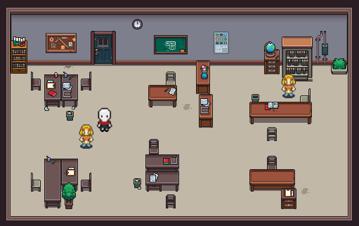

# Cybersyn: The Game

The attempt of the Chilean government to create a new political economy in the 1970s, based on the principles of cybernetics, has almost been lost to obscurity. Experience milestones of their Project Cybersyn and dive into a vision of the future that comes to you from the previous century.

The current version of the game is available to play here: 
[Cybersyn: The Game - Website](https://project-cybersyn-game.github.io/project-cybersyn-game?name=nocache)

## Local Installation for Development

For local development, the current Node.js LTS needs to be installed. Then, the following sequence of commands needs to be run within the repository root folder: 

1. `npm install`
2. `npm start`

Now, a local development server should be available at `localhost:8000`.

On subsequent programming sessions, only `npm start` needs to be run again. 